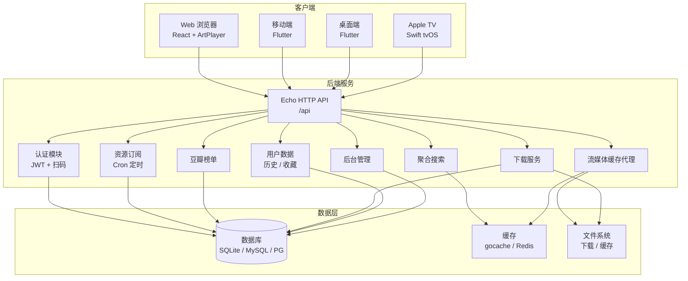
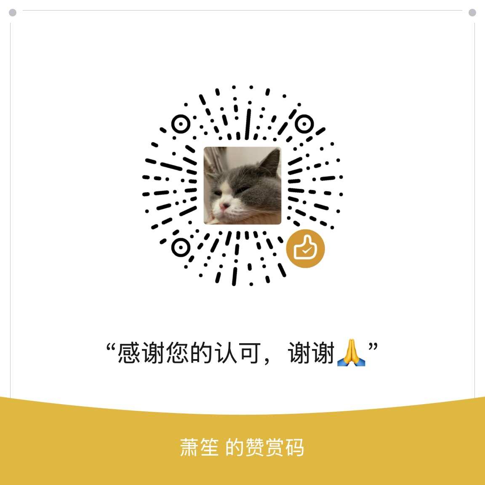

<div style="text-align: center;">

# 🐱 MeowTV

### 全栈视频聚合平台


[](https://go.dev/)
[](https://react.dev/)
[](https://flutter.dev/)
[](https://www.docker.com/)
[](LICENSE)

<p>聚合多源影视资源 · 多端统一播放体验 · 自建流媒体缓存与下载</p>

<p>
  <a href="#-功能特性">功能特性</a> ·
  <a href="#-技术栈">技术栈</a> ·
  <a href="#-项目结构">项目结构</a> ·
  <a href="#-快速开始">快速开始</a> ·
  <a href="#-docker-部署">Docker 部署</a> ·
  <a href="#-配置说明">配置说明</a>
</p>

</div>

---

## 📖 项目简介

**MeowTV** 是一个全栈视频聚合平台，支持多源资源订阅、聚合搜索、豆瓣榜单、播放历史、收藏管理、离线下载、流媒体缓存等功能。项目采用前后端分离架构，提供
Web、移动端（Android / iOS）、桌面端（macOS / Windows / Linux）及 Apple TV 多端客户端，统一后端 API，带来一致的播放体验。  
开发项目初衷是改善同类型开源项目的观影体验，优化播放器播放卡顿、资源可用但播放异常的问题。

### ⚠️ 重要提醒

> **写在前面**: 客户端默认采取激进的缓冲策略，对于流量和存储空间介意的朋友请自行将缓冲策略修改为HLS模式。  
> **注意**：部署后项目为空壳项目，无内置播放源，需要自行收集配置。  
> **免责声明**：本项目仅供学习和个人使用。使用者需自行确保遵守当地法律法规，项目不对任何资源内容负责。使用本软件所产生的一切后果由使用者自行承担。


---
---

## 🎥 使用演示

[](https://youtu.be/8xCHpnP5J5E)

## ✨ 功能特性

### 🎬 核心播放

- **多源聚合搜索**：一次搜索，多站点资源并行检索
- **资源订阅**：定时订阅资源站点，自动更新资源库
- **HLS 流媒体播放**：基于 HLS.js / video_player 的流畅播放体验
- **流媒体缓存代理**：后端代理 + 分片缓存，弱网环境下稳定播放
- **画质自适应（ABR）**：根据网络状况自动切换清晰度
- **弹幕支持**：弹幕加载、显示、轨道管理 (待实现)
- **字幕支持**：多字幕格式解析与渲染 (待实现)
- **投屏（DLNA / AirPlay）**：支持投屏到电视等大屏设备
- **画中画（PiP）**：小窗播放，边看边操作
- **截图 / GIF**：播放画面截图与 GIF 生成
- **睡眠定时器**：定时停止播放
- **播放模式**：单曲循环、列表循环、顺序播放等

### 📚 内容管理

- **豆瓣榜单同步**：定时同步豆瓣热门榜单，发现好剧
- **豆瓣图片代理**：图片代理加速，解决访问慢的问题
- **播放历史**：跨端同步播放进度，断点续播
- **收藏管理**：收藏喜爱的剧集，快速回看
- **搜索历史**：记录搜索历史，快速重复搜索

### ⬇️ 下载与缓存

- **离线下载**：后台下载任务管理，支持剧集批量下载
- **M3U8 分片下载**：解析并下载 HLS 视频分片
- **本地视频缓存**：移动端本地缓存，离线观看
- **缓存状态可视化**：缓存进度图标，一目了然

### 👤 用户与权限

- **JWT 认证**：Access Token + Refresh Token 双令牌机制
- **扫码登录**：Web 端展示二维码，移动端扫码登录
- **用户分组**：基于用户组的资源访问权限控制
- **后台管理**：可视化管理界面，配置资源、下载、流媒体等

### 🖥️ 多端支持

| 端        | 技术                                | 状态              |
|----------|-----------------------------------|-----------------|
| Web 浏览器  | React + Vite + ArtPlayer + HLS.js | ✅源码/Docker      |
| Android  | Flutter                           | ✅源码/Release下载   |
| iOS      | Flutter                           | ✅侧载/外区APP Store |
| macOS    | Flutter                           | ✅源码/Release下载   |
| Windows  | Flutter                           | ✅源码/Release下载   |
| Linux    | Flutter                           | ✅源码/Release下载   |
| Apple TV | Swift / tvOS 原生                   | ✅外区APP Store    |

---

## 🛠️ 技术栈

### 后端

| 技术                                                      | 用途              |
|---------------------------------------------------------|-----------------|
| [Go 1.25](https://go.dev/)                              | 后端开发语言          |
| [Echo](https://echo.labstack.com/)                      | HTTP Web 框架     |
| [GORM](https://gorm.io/)                                | ORM 数据库操作       |
| SQLite / MySQL / PostgreSQL                             | 数据库（默认 SQLite）  |
| [Wire](https://github.com/google/wire)                  | 编译时依赖注入         |
| [Viper](https://github.com/spf13/viper)                 | 配置管理            |
| [go-redis](https://github.com/redis/go-redis)           | Redis 缓存客户端     |
| [Ristretto](https://github.com/dgraph-io/ristretto)     | 高性能内存缓存         |
| [golang-jwt](https://github.com/golang-jwt/jwt)         | JWT 认证          |
| [bcrypt](https://pkg.go.dev/golang.org/x/crypto/bcrypt) | 密码加密            |
| [robfig/cron](https://github.com/robfig/cron)           | 定时任务            |
| [FFmpeg](https://ffmpeg.org/)                           | 视频转码（Docker 内置） |

### 前端 Web

| 技术                                                                            | 用途        |
|-------------------------------------------------------------------------------|-----------|
| [React 19](https://react.dev/)                                                | UI 框架     |
| [Vite](https://vitejs.dev/)                                                   | 构建工具      |
| [TypeScript](https://www.typescriptlang.org/)                                 | 类型系统      |
| [TailwindCSS](https://tailwindcss.com/) + [shadcn/ui](https://ui.shadcn.com/) | UI 组件     |
| [ArtPlayer](https://artplayer.org/)                                           | 视频播放器     |
| [HLS.js](https://github.com/video-dev/hls.js)                                 | HLS 流媒体播放 |
| [Zustand](https://github.com/pmndrs/zustand)                                  | 状态管理      |
| [React Router](https://reactrouter.com/)                                      | 路由管理      |

### 移动端 / 桌面端

| 技术                                                                                                | 用途        |
|---------------------------------------------------------------------------------------------------|-----------|
| [Flutter](https://flutter.dev/)                                                                   | 跨平台 UI 框架 |
| [Riverpod](https://riverpod.dev/)                                                                 | 状态管理      |
| [go_router](https://pub.dev/packages/go_router)                                                   | 声明式路由     |
| [Dio](https://pub.dev/packages/dio)                                                               | HTTP 网络请求 |
| [video_player](https://pub.dev/packages/video_player) + [Chewie](https://pub.dev/packages/chewie) | 视频播放      |
| [flutter_secure_storage](https://pub.dev/packages/flutter_secure_storage)                         | 安全存储      |
| [dart_cast](https://pub.dev/packages/dart_cast)                                                   | DLNA 投屏   |

### Apple TV

| 技术                                                | 用途         |
|---------------------------------------------------|------------|
| Swift 5.10                                        | 开发语言       |
| tvOS 17.0+                                        | 目标平台       |
| [XcodeGen](https://github.com/yonaskolb/XcodeGen) | Xcode 工程生成 |

### 基础设施

| 技术                                                 | 用途       |
|----------------------------------------------------|----------|
| [Docker](https://www.docker.com/) / Docker Compose | 容器化部署    |
| 多架构构建（amd64 / arm64）                               | 跨平台镜像    |
| Nginx                                              | 前端静态资源服务 |

---

## 📂 项目结构

```
MeowTV/
├── backend/                    # 后端服务
│   ├── main.go                 # 程序入口
│   ├── go.mod                  # Go 模块定义
│   ├── configs/                # 配置文件目录
│   │   ├── app.example.yaml    # 配置模板
│   │   ├── app.yaml            # 基础配置
│   │   ├── app.dev.yaml        # 开发环境覆盖
│   │   ├── app.prod.yaml       # 生产环境覆盖
│   │   └── sys_config.example.yaml  # 动态配置参考
│   ├── internal/               # 内部包
│   │   ├── auth/               # 认证（JWT / 黑名单 / 扫码）
│   │   ├── cache/              # 缓存（gocache / redis / ristretto / 多级）
│   │   ├── config/             # 配置加载与加解密
│   │   ├── errs/               # 错误码与错误处理
│   │   ├── handler/            # HTTP 处理器（控制器层）
│   │   │   └── middleware/     # 中间件（认证 / CORS / 限流 / 日志）
│   │   ├── logger/             # 日志（slog，按天轮转）
│   │   ├── migration/          # 数据库迁移
│   │   ├── model/              # 数据模型
│   │   │   ├── dto/            # 数据传输对象
│   │   │   │   ├── request/    # 请求结构
│   │   │   │   └── response/   # 响应结构
│   │   │   └── entity/         # 数据库实体
│   │   ├── repository/         # 数据访问层
│   │   ├── router/             # 路由注册
│   │   ├── service/            # 业务逻辑层
│   │   │   ├── auth_service.go
│   │   │   ├── douban_*.go     # 豆瓣相关服务
│   │   │   ├── download_*.go   # 下载服务
│   │   │   ├── resource_*.go   # 资源服务
│   │   │   ├── search_*.go     # 搜索服务
│   │   │   ├── stream_*.go     # 流媒体缓存服务
│   │   │   └── ...
│   │   ├── util/               # 工具函数
│   │   └── wire/               # 依赖注入
│   ├── data/                   # 数据目录（SQLite / 下载 / 缓存）
│   ├── logs/                   # 日志目录
│   └── migrations/             # 数据库迁移文件
│
├── frontend/                   # 前端
│   ├── web/                    # Web 端（React）
│   │   ├── src/
│   │   │   ├── api/            # API 请求封装
│   │   │   ├── hooks/          # 自定义 Hooks
│   │   │   ├── router/         # 路由配置
│   │   │   ├── stores/         # Zustand 状态管理
│   │   │   ├── styles/         # 样式文件
│   │   │   └── types/          # 类型定义
│   │   ├── package.json
│   │   └── vite.config.ts
│   │
│   ├── app/                    # 移动端 / 桌面端（Flutter）
│   │   ├── lib/
│   │   │   ├── main.dart        # 入口
│   │   │   ├── core/            # 核心模块
│   │   │   │   ├── cache/       # 视频缓存
│   │   │   │   ├── network/     # 网络请求
│   │   │   │   ├── router/      # 路由
│   │   │   │   ├── stream/      # 流媒体缓存
│   │   │   │   ├── theme/       # 主题
│   │   │   │   └── utils/      # 工具
│   │   │   ├── features/        # 功能模块
│   │   │   │   ├── admin/       # 后台管理
│   │   │   │   ├── auth/        # 认证
│   │   │   │   ├── detail/      # 详情
│   │   │   │   ├── download/    # 下载
│   │   │   │   ├── favorites/   # 收藏
│   │   │   │   ├── history/     # 历史
│   │   │   │   ├── home/        # 首页
│   │   │   │   ├── player/      # 播放器
│   │   │   │   │   ├── danmaku/ # 弹幕
│   │   │   │   │   ├── subtitle/# 字幕
│   │   │   │   │   ├── cast/    # 投屏
│   │   │   │   │   ├── capture/ # 截图
│   │   │   │   │   ├── pip/     # 画中画
│   │   │   │   │   └── quality/ # 画质
│   │   │   │   ├── search/      # 搜索
│   │   │   │   └── settings/    # 设置
│   │   │   ├── screens/        # 页面
│   │   │   └── shared/         # 共享组件与模型
│   │   └── pubspec.yaml
│   │
│   └── apple-tv/               # Apple TV 端（Swift）
│       ├── Sources/
│       │   ├── Core/            # 核心模块
│       │   └── Shared/          # 共享组件
│       └── project.yml          # XcodeGen 配置
│
├── scripts/                    # 脚本
│   ├── Makefile                # 构建命令
│   ├── backend/                # 后端部署
│   │   ├── Dockerfile          # 后端镜像构建
│   │   ├── docker-compose.yml  # 后端编排
│   │   ├── build_push.sh       # 构建推送脚本
│   │   └── deploy.sh           # 部署脚本
│   └── frontend/               # 前端部署
│       ├── web/                # Web 端 Docker
│       ├── app/                # 移动端构建
│       ├── macos/              # macOS 构建
│       └── windows/            # Windows 构建
│
└── docs/                       # 文档
    ├── meowtv-api-integration.md  # API 对接文档
    ├── MeowTV.png              # Logo 图片
    └── MeowTV.svg              # Logo 矢量图
```

---

## 🚀 快速开始

### 环境要求

- **Go** >= 1.25
- **Node.js** >= 22 + **pnpm** >= 9
- **Flutter** >= 3.x
- **Docker** + **Docker Compose**（推荐）
- **FFmpeg**（流媒体转码，Docker 镜像已内置）

### 方式一：Docker Compose 部署（推荐）

最简单的部署方式，一条命令启动后端服务：

```bash
# 1. 克隆仓库
git clone https://github.com/cn-meowy/MeowTV.git
cd MeowTV

# 2. 进入后端部署目录
cd scripts/backend

# 3. 启动服务（使用默认配置即可启动）
docker compose up -d
```

启动后访问 `http://localhost:8088`，默认管理员账号：

| 项   | 默认值                       |
|-----|---------------------------|
| 用户名 | `admin`                   |
| 密码  | `admin123`（或启动日志中的自动生成密码） |

> ⚠️ 生产环境请务必通过环境变量 `MEOWTV_AUTH_JWT_SECRET` 和 `MEOWTV_AUTH_ADMIN_PASSWORD` 修改默认值。

### 方式二：源码运行后端

```bash
# 1. 克隆仓库
git clone https://github.com/cn-meowy/MeowTV.git
cd MeowTV

# 2. 复制配置文件
cp backend/configs/app.example.yaml backend/configs/app.yaml

# 3. 安装依赖并运行
cd backend
go mod download
go run main.go
```

后端默认监听 `:8088`，API 基础路径为 `/api`。

### 方式三：源码运行前端 Web

```bash
# 1. 进入前端目录
cd frontend/web

# 2. 安装依赖
pnpm install

# 3. 配置环境变量
cp .env.development .env  # 按需修改 API 地址

# 4. 启动开发服务器
pnpm dev
```

开发服务器默认运行在 `http://localhost:5173`。

### 方式四：源码运行 Flutter 移动端

```bash
# 1. 进入移动端目录
cd frontend/app

# 2. 安装依赖
flutter pub get

# 3. 运行（连接模拟器或真机）
flutter run
```

---

## 🐳 Docker 部署

### 后端

作者已在 Docker Hub 发布镜像，推荐直接拉取使用：

> 📦 后台镜像地址：[https://hub.docker.com/r/xiaosheng078/meowtv](https://hub.docker.com/r/xiaosheng078/meowtv)
> 
> 📦 WEB镜像地址：[https://hub.docker.com/r/xiaosheng078/meowtv-web](https://hub.docker.com/r/xiaosheng078/meowtv-web)
>
> 镜像内置 FFmpeg，支持 amd64 / arm64 双架构，开箱即用。

#### 方式一：拉取官方镜像运行（推荐）

```bash

# 拉取镜像
docker pull xiaosheng078/meowtv:latest

## 环境准备
# 复制默认配置文件 / 从源码获取上传
docker run -d --name meowtv -e PUID=$(id -u) -e PGID=$(id -g) xiaosheng078/meowtv:latest && docker cp meowtv:/app/configs .
# 清理临时容器
docker stop meowtv && docker rm meowtv

# 运行容器
# PUID/PGID 须与宿主机用户一致；entrypoint 据此 chown 挂载目录并 gosu 降权，无需 --user
docker run -d \
  --name meowtv \
  -e PUID=$(id -u) \
  -e PGID=$(id -g) \
  -p 8088:8088 \
  -v $(pwd)/configs:/app/configs:ro \
  -v $(pwd)/data:/app/data \
  -v $(pwd)/logs:/app/logs \
  -e MEOWTV_APP_ENV=prod \
  -e MEOWTV_AUTH_JWT_SECRET=your-secret-key \
  -e MEOWTV_AUTH_ADMIN_PASSWORD=your-password \
  --restart unless-stopped \
  xiaosheng078/meowtv:latest
```

#### 方式二：Docker Compose

Docker Compose 方式见 [`scripts/backend/docker-compose.yml`](scripts/backend/docker-compose.yml)（默认使用
`xiaosheng078/meowtv:latest` 镜像）。该 compose 通过 `PUID`/`PGID` 环境变量指定运行用户（默认 1000:1000，
entrypoint 据此 chown 挂载目录并 `gosu` 降权），须与宿主机用户一致：

```bash
cd scripts/backend

# 方式 A（推荐）：用部署脚本，自动传入当前用户 uid/gid
sudo ./deploy.sh --uid $(id -u) --gid $(id -g)

# 方式 B：直接 compose，需先 export PUID/PGID
export PUID=$(id -u) PGID=$(id -g)
docker compose up -d
```

> ⚠️ `$(id -u)`/`$(id -g)` 必须由当前用户 shell 在 sudo 提权**前**展开为字面量。切勿写成
> `sudo bash -c './deploy.sh --uid $(id -u) ...'`，那样会在 root shell 内展开为 0，导致容器以 root 运行。

#### 方式三：自行构建

如需修改源码后自行构建，Dockerfile 位于 [`scripts/backend/Dockerfile`](scripts/backend/Dockerfile)：

```bash
# 构建镜像（从项目根目录）
docker build -f scripts/backend/Dockerfile -t meowtv:latest backend/
```

### 前端 Web

前端 Dockerfile 位于 [`scripts/frontend/web/Dockerfile`](scripts/frontend/web/Dockerfile)，使用 Nginx 运行静态产物。

```bash
# 拉取镜像
docker pull xiaosheng078/meowtv-web:latest

# 运行容器
docker run -d \
  --name meowtv-web \
  -p 180:80 \
  -e API_BASE_URL=http://your-backend-host:8088 \
  xiaosheng078/meowtv-web:latest
```

### 多架构构建

```bash
# 后端多架构构建并推送
docker buildx build \
  --platform linux/amd64,linux/arm64 \
  -f scripts/backend/Dockerfile \
  -t meowtv:latest \
  backend/ --push

# 前端多架构构建并推送
docker buildx build \
  --platform linux/amd64,linux/arm64 \
  -f scripts/frontend/web/Dockerfile \
  -t meowtv-web:latest \
  frontend/ --push
```

---

## ⚙️ 配置说明

### 配置加载优先级

配置加载优先级从高到低：

1. **命令行参数**：`-e <env>` / `--env <env>`、`-c <path>` / `--config <path>`
2. **环境变量**：`MEOWTV_` 前缀（如 `MEOWTV_APP_DEBUG=true`）
3. **环境特定配置**：`app.<env>.yaml`（如 `app.prod.yaml`）
4. **基础配置**：`app.yaml`
5. **代码默认值**

### 静态配置

静态配置文件位于 [`backend/configs/`](backend/configs/) 目录，完整说明见 [
`app.example.yaml`](backend/configs/app.example.yaml)：

| 配置块      | 说明       | 关键字段                                               |
|----------|----------|----------------------------------------------------|
| `app`    | 应用基础配置   | `name` / `env` / `debug`                           |
| `server` | HTTP 服务器 | `port` / `read_timeout` / `write_timeout`          |
| `db`     | 数据库      | `driver`（sqlite/mysql/postgres）/ `dsn`             |
| `cache`  | 缓存       | `type`（gocache/ristretto/redis/multilevel）         |
| `auth`   | 认证       | `jwt_secret` / `admin_username` / `admin_password` |
| `log`    | 日志       | `console` / `file` / `dir`                         |
| `cors`   | 跨域       | `allowed_origins`                                  |

### 动态配置（sys_config）

存储在数据库 `sys_config` 表中的动态配置支持热更新，无需重启服务。包括：

- **豆瓣数据通道**：JSON 数据源配置
- **资源订阅**：资源站点订阅与定时更新
- **流媒体缓存**：缓存策略配置
- **下载配置**：下载并发数、存储路径等

完整参考见 [`backend/configs/sys_config.example.yaml`](backend/configs/sys_config.example.yaml)。

### 常用环境变量

| 环境变量                         | 默认值        | 说明               |
|------------------------------|------------|------------------|
| `MEOWTV_APP_ENV`             | `dev`      | 运行环境（dev / prod） |
| `MEOWTV_SERVER_PORT`         | `8088`     | 服务端口             |
| `MEOWTV_DB_DRIVER`           | `sqlite`   | 数据库驱动            |
| `MEOWTV_AUTH_JWT_SECRET`     | -          | JWT 密钥（生产环境必须设置） |
| `MEOWTV_AUTH_ADMIN_USERNAME` | `admin`    | 管理员用户名           |
| `MEOWTV_AUTH_ADMIN_PASSWORD` | `admin123` | 管理员密码            |
| `MEOWTV_ENCRYPTION_KEY`      | -          | 敏感配置加密密钥         |
| `MEOWTV_CACHE_TYPE`          | `gocache`  | 缓存类型             |

---

## 📡 API 文档

前后端接口对接文档见 [`docs/meowtv-api-integration.md`](docs/meowtv-api-integration.md)，涵盖以下模块：

- **认证模块** `/api/auth`：登录、登出、Token 刷新、扫码登录
- **用户模块** `/api/user`：用户信息、资料修改
- **豆瓣模块** `/api/douban`：榜单、影视详情
- **资源模块** `/api/resource`：资源搜索、详情、订阅
- **用户数据** `/api/user-data`：播放历史、收藏、搜索历史
- **下载模块** `/api/download`：下载任务管理
- **流媒体模块** `/api/stream`：流媒体缓存代理
- **管理后台** `/api/admin`：系统配置、用户管理、资源组管理

认证方式：JWT Bearer Token

```
Authorization: Bearer <access_token>
```

统一响应格式：

```json
{
  "code": 200,
  "msg": "success",
  "data": {
    ...
  }
}
```

---

## 🏗️ 架构概览



---

## 📄 License

```text
MIT License

Copyright (c) 2026 [cn-meowy]

Permission is hereby granted, free of charge, to any person obtaining a copy
of this software and associated documentation files (the "Software"), to deal
in the Software without restriction, including without limitation the rights
to use, copy, modify, merge, publish, distribute, sublicense, and/or sell
copies of the Software, and to permit persons to whom the Software is
furnished to do so, subject to the following conditions:

The above copyright notice and this permission notice shall be included in all
copies or substantial portions of the Software.

THE SOFTWARE IS PROVIDED "AS IS", WITHOUT WARRANTY OF ANY KIND, EXPRESS OR
IMPLIED, INCLUDING BUT NOT LIMITED TO THE WARRANTIES OF MERCHANTABILITY,
FITNESS FOR A PARTICULAR PURPOSE AND NONINFRINGEMENT. IN NO EVENT SHALL THE
AUTHORS OR COPYRIGHT HOLDERS BE LIABLE FOR ANY CLAIM, DAMAGES OR OTHER
LIABILITY, WHETHER IN AN ACTION OF CONTRACT, TORT OR OTHERWISE, ARISING FROM,
OUT OF OR IN CONNECTION WITH THE SOFTWARE OR THE USE OR OTHER DEALINGS IN THE
SOFTWARE.
```

---

## 🙏 鸣谢

- [Echo](https://echo.labstack.com/) — Go Web 框架
- [GORM](https://gorm.io/) — Go ORM
- [React](https://react.dev/) — Web UI 框架
- [ArtPlayer](https://artplayer.org/) — Web 视频播放器
- [HLS.js](https://github.com/video-dev/hls.js) — HLS 播放库
- [Flutter](https://flutter.dev/) — 跨平台 UI 框架
- [shadcn/ui](https://ui.shadcn.com/) — React UI 组件
- [TailwindCSS](https://tailwindcss.com/) — CSS 框架
- [FFmpeg](https://ffmpeg.org/) — 多媒体处理
- [DecoTV](https://github.com/Decohererk/DecoTV) — 项目灵感来源

---

<div style="text-align: center;">

## 💝 赞赏支持

如果这个项目对你有所帮助，欢迎 Star ⭐ 本项目或请作者喝杯咖啡 ☕

<div style="text-align: center;">

<br>
<sub><b>🎨 微信赞赏</b></sub>
</div>

---

<div style="text-align: center;">
  <p>
    <strong>🌟 如果觉得项目有用，请点个 Star 支持一下！🌟</strong>
  </p>
</div>
</div>
