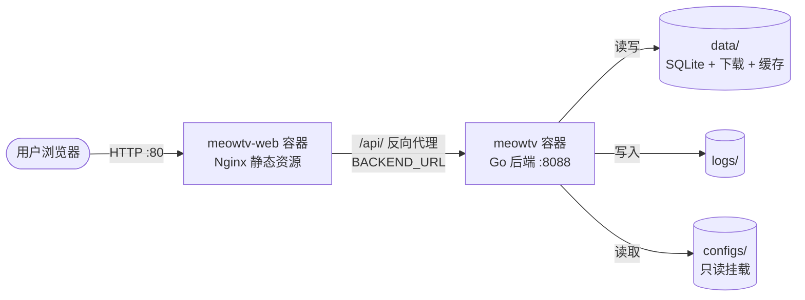

# 🐳 MeowTV Docker 镜像说明

本文件是对 [`README.md`](../README.md) 中「Docker 部署」章节的补充，集中说明 MeowTV **后端服务镜像**与**前端 Web 镜像**的构建细节、运行机制与配置项，方便部署时查阅。

> 本文仅覆盖部署用镜像，不涉及 Flutter App 构建镜像（[`scripts/frontend/app/`](../scripts/frontend/app/)），后者用于构建 Android APK 产物，非运行时镜像。

---

## 📋 镜像总览

| 镜像 | 仓库地址 | 运行时基础镜像 | 架构 | 内置依赖 | 暴露端口 |
|------|---------|--------------|------|---------|---------|
| 后端服务 | [xiaosheng078/meowtv](https://hub.docker.com/r/xiaosheng078/meowtv) | `debian:bookworm-slim` | amd64 / arm64 | FFmpeg、ca-certificates、tzdata、curl | 8088 |
| 前端 Web | 本地构建 `meowtv-web` | `nginx:1.27-alpine` | amd64 / arm64 | gettext（envsubst） | 80 |

### 联合部署架构



前端 Web 容器通过 Nginx 将 `/api/` 请求反向代理到后端容器，用户只需访问前端端口即可同时获得页面与 API 服务。

---

## 🔧 后端服务镜像

### Dockerfile 位置

[`scripts/backend/Dockerfile`](../scripts/backend/Dockerfile)，构建上下文为 [`backend/`](../backend/) 目录。

### 多阶段构建

镜像采用两阶段构建，编译产物与运行环境分离，最终镜像体积更小：

#### 阶段 1：builder（编译 Go 二进制）

- 基础镜像：`golang:1.25-bookworm`
- 安装 CGO 编译依赖：`gcc`、`libc6-dev`（因为依赖 [`mattn/go-sqlite3`](https://github.com/mattn/go-sqlite3)，需启用 CGO）
- 利用 `--mount=type=cache` 缓存 Go 模块，加速重复构建
- 按 `TARGETOS` / `TARGETARCH` 参数编译目标架构二进制
- 注意：builder 阶段**不使用** `--platform=$BUILDPLATFORM`，而是按目标架构运行，这样 CGO 编译时的 gcc 天然为目标架构，避免在 amd64 主机上交叉编译 arm64 CGO 失败（arm64 会在 QEMU 模拟下构建，较慢但工具链完整）

#### 阶段 2：runtime（最终运行镜像）

- 基础镜像：`debian:bookworm-slim`
- 安装运行时依赖：
  - `ffmpeg` —— 流媒体转码核心依赖（使用系统包而非静态编译）
  - `ca-certificates` —— HTTPS 请求证书
  - `tzdata` —— 时区数据
  - `curl` —— 健康检查
- 时区与语言：`TZ=Asia/Shanghai`、`LC_ALL=C.UTF-8`、`LANG=C.UTF-8`

### 安全特性

- 创建非 root 用户 `meowtv`（UID 1000 / GID 1000）运行容器，降低提权风险
- 工作目录 `/app`，数据目录 `/app/data`、日志目录 `/app/logs` 均归 `meowtv` 用户所有

### 健康检查

Dockerfile 内置 `HEALTHCHECK`，容器启动 10s 后开始检查，每 30s 一次：

```dockerfile
HEALTHCHECK --interval=30s --timeout=5s --start-period=10s --retries=3 \
    CMD curl -f http://localhost:${MEOWTV_SERVER_PORT:-8088}/health || exit 1
```

### 容器内目录与卷挂载

| 容器路径 | 用途 | 挂载方式 |
|---------|------|---------|
| `/app/meowtv` | Go 二进制 | 镜像内置 |
| `/app/configs` | 配置文件目录 | bind mount，只读（`:ro`） |
| `/app/data` | SQLite 数据库 + 下载文件 + 图片缓存 | bind mount，读写 |
| `/app/logs` | 日志文件（按天轮转） | bind mount，读写 |

### 关键环境变量

| 环境变量 | 默认值 | 说明 |
|---------|-------|------|
| `MEOWTV_APP_ENV` | `prod` | 运行环境（dev / prod） |
| `MEOWTV_APP_DEBUG` | `false` | 调试模式（生产环境应关闭） |
| `MEOWTV_SERVER_PORT` | `8088` | 服务监听端口 |
| `MEOWTV_AUTH_JWT_SECRET` | - | JWT 密钥（生产环境**必须**修改） |
| `MEOWTV_AUTH_ADMIN_USERNAME` | `admin` | 管理员用户名 |
| `MEOWTV_AUTH_ADMIN_PASSWORD` | `admin123` | 管理员密码（生产环境**必须**修改） |
| `MEOWTV_ENCRYPTION_KEY` | - | 敏感配置加密密钥 |
| `MEOWTV_DB_DRIVER` | `sqlite` | 数据库驱动（sqlite / mysql / postgres） |
| `MEOWTV_CACHE_TYPE` | `gocache` | 缓存类型 |
| `MEOWTV_LOG_DIR` | `/app/logs` | 日志输出目录 |

> 完整环境变量与配置加载优先级见 [`backend/configs/app.example.yaml`](../backend/configs/app.example.yaml) 与 [`README.md`](../README.md#-配置说明)。

### 构建命令

```bash
# 单架构构建（从项目根目录）
docker build -f scripts/backend/Dockerfile -t meowtv:latest backend/

# 多架构构建并推送
docker buildx build \
  --platform linux/amd64,linux/arm64 \
  -f scripts/backend/Dockerfile \
  -t xiaosheng078/meowtv:latest \
  backend/ --push
```

### 拉取官方镜像并运行

```bash
# 拉取镜像
docker pull xiaosheng078/meowtv:latest

# 运行容器
docker run -d \
  --name meowtv \
  -p 8088:8088 \
  -v $(pwd)/backend/configs:/app/configs:ro \
  -v $(pwd)/backend/data:/app/data \
  -v $(pwd)/backend/logs:/app/logs \
  -e MEOWTV_APP_ENV=prod \
  -e MEOWTV_AUTH_JWT_SECRET=your-secret-key \
  -e MEOWTV_AUTH_ADMIN_PASSWORD=your-password \
  --restart unless-stopped \
  xiaosheng078/meowtv:latest
```

### Docker Compose

编排文件位于 [`scripts/backend/docker-compose.yml`](../scripts/backend/docker-compose.yml)：

```bash
cd scripts/backend
docker compose up -d
```

辅助脚本：

- [`scripts/backend/build_push.sh`](../scripts/backend/build_push.sh) —— 多架构构建并推送到 Docker Hub，支持自动 tag（git tag 或短哈希）、`--no-latest`、`--no-load` 等选项
- [`scripts/backend/deploy.sh`](../scripts/backend/deploy.sh) —— 本地构建 + 部署一体化脚本，支持 `--build` / `--deploy` / `--full` 模式

---

## 🌐 前端 Web 镜像

### Dockerfile 位置

[`scripts/frontend/web/Dockerfile`](../scripts/frontend/web/Dockerfile)，构建上下文为 [`frontend/`](../frontend/) 目录。

### 多阶段构建

#### 阶段 1：builder（构建前端产物）

- 基础镜像：`node:22-alpine`
- 通过 `corepack` 启用 `pnpm@9.0.0`
- 先复制 `package.json` 与 `pnpm-lock.yaml` 安装依赖（利用 Docker 缓存层）
- `pnpm install --frozen-lockfile` 确保依赖一致性
- `pnpm run build` 产出生产构建产物到 `dist/`

#### 阶段 2：runtime（Nginx 运行）

- 基础镜像：`nginx:1.27-alpine`
- 安装 `gettext`，提供 `envsubst` 命令用于模板替换
- 复制内容：
  - 前端构建产物 `dist/` → `/usr/share/nginx/html/`
  - Nginx 配置模板 → `/etc/nginx/conf.d/default.conf.template`
  - 启动脚本 [`entrypoint.sh`](../scripts/frontend/web/entrypoint.sh) → `/entrypoint.sh`

### 运行时机制

容器启动时由 [`entrypoint.sh`](../scripts/frontend/web/entrypoint.sh) 完成配置生成：

1. 读取环境变量 `BACKEND_URL`（默认 `http://meowtv:8088`）
2. 使用 `envsubst` 将 [`nginx.conf.template`](../scripts/frontend/web/nginx.conf.template) 中的 `${BACKEND_URL}` 占位符替换为实际值
3. 生成最终 `/etc/nginx/conf.d/default.conf`
4. `nginx -t` 校验语法后启动 Nginx（`daemon off`）

> ⚠️ 环境变量名为 `BACKEND_URL`，指定后端 API 地址。若前端与后端在同一个 Docker 网络中，可直接用容器名 `http://meowtv:8088`。

### Nginx 配置特性

[`nginx.conf.template`](../scripts/frontend/web/nginx.conf.template) 提供以下能力：

| 特性 | 说明 |
|------|------|
| SPA 路由回退 | `location /` 使用 `try_files ... /index.html`，支持前端路由 |
| API 反向代理 | `location /api/` 代理到 `${BACKEND_URL}`，传递 `X-Real-IP` / `X-Forwarded-For` 等头 |
| 静态资源长缓存 | JS/CSS/字体缓存 1 年（`immutable`），Vite 构建产物带 hash 无缓存破坏问题 |
| 图片资源缓存 | 图片缓存 6 个月 |
| HTML 不缓存 | 确保用户获取最新 `index.html` |
| Gzip 压缩 | 压缩文本、JS、CSS、JSON、SVG 等 |
| 安全头 | `X-Frame-Options`、`X-Content-Type-Options`、`X-XSS-Protection` |
| 隐藏文件保护 | 禁止访问 `.` 开头的隐藏文件 |

### 关键环境变量

| 环境变量 | 默认值 | 说明 |
|---------|-------|------|
| `BACKEND_URL` | `http://meowtv:8088` | 后端 API 服务地址，用于 Nginx 反向代理 |

### 构建与运行命令

```bash
# 构建镜像（从项目根目录）
docker build -f scripts/frontend/web/Dockerfile -t meowtv-web:latest frontend/

# 运行容器
docker run -d \
  --name meowtv-web \
  -p 80:80 \
  -e BACKEND_URL=http://your-backend-host:8088 \
  --restart unless-stopped \
  meowtv-web:latest

# 多架构构建并推送
docker buildx build \
  --platform linux/amd64,linux/arm64 \
  -f scripts/frontend/web/Dockerfile \
  -t meowtv-web:latest \
  frontend/ --push
```

---

## 🚀 联合部署示例

以下 `docker-compose.yml` 将前端 Web 与后端服务联合部署，前端通过 Docker 内部网络访问后端，用户只需暴露前端 80 端口：

```yaml
services:
  meowtv:
    image: xiaosheng078/meowtv:latest
    container_name: meowtv
    restart: unless-stopped
    ports:
      - "8088:8088"
    volumes:
      - ./backend/configs:/app/configs:ro
      - ./backend/data:/app/data
      - ./backend/logs:/app/logs
    environment:
      - MEOWTV_APP_ENV=prod
      - MEOWTV_APP_DEBUG=false
      - MEOWTV_SERVER_PORT=8088
      - MEOWTV_AUTH_JWT_SECRET=your-secret-key        # 生产环境必须修改
      - MEOWTV_AUTH_ADMIN_PASSWORD=your-password       # 生产环境必须修改
      - MEOWTV_LOG_CONSOLE=true
      - MEOWTV_LOG_FILE=true
      - MEOWTV_LOG_DIR=/app/logs
    healthcheck:
      test: ["CMD", "curl", "-f", "http://localhost:8088/health"]
      interval: 30s
      timeout: 5s
      retries: 3
      start_period: 10s

  meowtv-web:
    image: meowtv-web:latest
    container_name: meowtv-web
    restart: unless-stopped
    ports:
      - "80:80"
    environment:
      - BACKEND_URL=http://meowtv:8088   # 通过容器名访问后端
    depends_on:
      meowtv:
        condition: service_healthy

networks:
  default:
    driver: bridge
```

部署步骤：

1. 将前端 Web 镜像构建到本地：`docker build -f scripts/frontend/web/Dockerfile -t meowtv-web:latest frontend/`
2. 将上述内容保存为 `docker-compose.yml`
3. 启动：`docker compose up -d`
4. 访问 `http://localhost` 即可使用，API 由 Nginx 自动代理到后端

> 若仅需后端服务，可直接使用项目自带的 [`scripts/backend/docker-compose.yml`](../scripts/backend/docker-compose.yml)。

---

## 📝 备注

- 后端镜像的 arm64 构建依赖 QEMU 模拟，CGO 编译较 amd64 慢，属正常现象
- 前端 Web 镜像当前未发布到 Docker Hub，需本地构建
- 生产环境部署时，务必通过环境变量修改 `MEOWTV_AUTH_JWT_SECRET` 与 `MEOWTV_AUTH_ADMIN_PASSWORD` 默认值
- 配置文件目录建议以只读方式挂载（`:ro`），数据与日志目录需可读写
